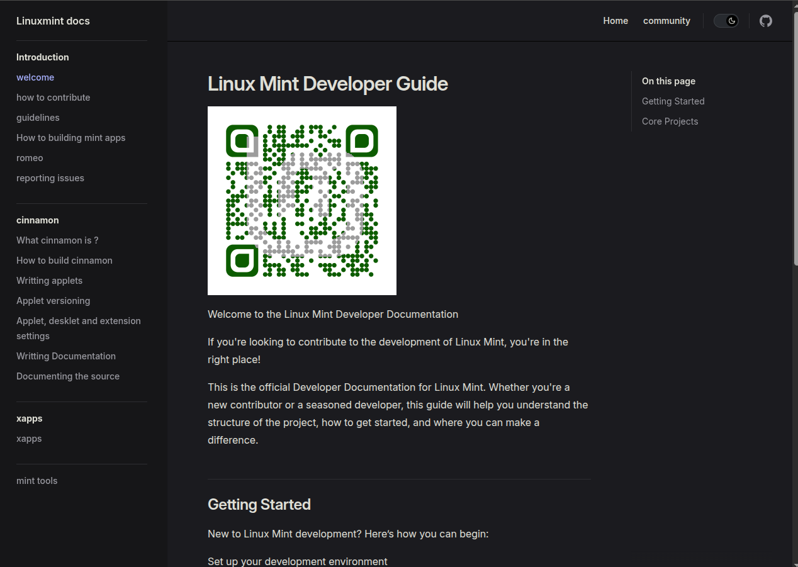

# Linux mint documentation 

This is the linux mint documention site. It uses vite press moved from a custom version.


## Screenshots




## Run Locally

Clone the project

```bash
  git clone https://github.com/SuperninjaXII/linuxmint.github.io
```

Go to the project directory

```bash
  cd linuxmint.github.io 
```

Install dependencies

```bash
  pnpm install
```

Start the server

```bash
 pnpm run docs:dev
```


## Badges

licenses: [shields.io](https://shields.io/)

[](https://choosealicense.com/licenses/mit/)
[](https://opensource.org/licenses/)
[](http://www.gnu.org/licenses/agpl-3.0)


## Support

For support,  join our matrix channel [matrix ](https://app.element.io/#/room/#linuxmint-space:matrix.org).

