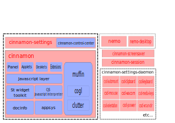

# Set Up

This chapter explains how to get your computer set up.

## Create a Sandbox

When you build projects it produces `.deb` packages in their parent directory, so it's a good idea to create a directory for all your development needs, in which you'll have subdirectories for each project, or each group of projects. This keeps things tidy and well organized in your computer so it becomes easier to search for code across different projects.

We commonly call our main development directory "Sandbox" and place it in our home folder.

```bash
mkdir ~/Sandbox
````

Of course, you can call your "Sandbox" whatever you want and place it anywhere you want as well.

## Install mint-dev-tools

Install the `mint-dev-tools` package from the Linux Mint repositories.

```bash
apt update
apt install mint-dev-tools --install-recommends
```

It contains useful tools to help you compile and develop Linux Mint projects.


## Overview

The Cinnamon desktop environment is a very large development project.

Between 2006 and 2010 the main desktop environment for Linux Mint was GNOME 2. It was very stable and very popular.

In 2011, Linux Mint 12 was unable to ship with GNOME 2. The upstream GNOME team had released a brand new desktop (GNOME 3 aka "Gnome Shell") which was using new technologies (Clutter, GTK3), which had a completely different design and implemented a radically different paradigm than its predecessor but which used the same namespaces and thus it couldn't be installed alongside GNOME 2.

To tackle this issue two new projects were started:

* **MATE**: A fork of GNOME 2.
* **MGSE**: GNOME 3 extensions to restore GNOME 2-like behavior.

From MGSE came Cinnamon, a full fork of GNOME 3. Linux Mint 13 was the first to ship Cinnamon officially.

---

## Processes



At session start, Cinnamon launches:

* `cinnamon-session`
* `cinnamon`
* `nemo-desktop`
* `cinnamon-screensaver`
* various `csd-*` processes

---

## Libraries

### cinnamon-menus

Reads and monitors installed applications.
[GitHub](https://github.com/linuxmint/cinnamon-menus)

### cinnamon-desktop

Utility library for shared settings and functions.
<table border="1" cellspacing="0" cellpadding="8">
  <thead>
    <tr>
      <th>Resource</th>
      <th>Description</th>
    </tr>
  </thead>
  <tbody>
    <tr>
      <td>cinnamon.desktop</td>
      <td>Shared dconf schemas</td>
    </tr>
    <tr>
      <td>libcvc</td>
      <td>PulseAudio volume control</td>
    </tr>
    <tr>
      <td>gnomerr</td>
      <td>Monitor configs</td>
    </tr>
    <tr>
      <td>gnome-xkb</td>
      <td>Keyboard layouts</td>
    </tr>
    <tr>
      <td>gnome-bg</td>
      <td>Wallpaper handling</td>
    </tr>
    <tr>
      <td>gnome-installer</td>
      <td>App installation helper</td>
    </tr>
  </tbody>
</table>

[GitHub](https://github.com/linuxmint/cinnamon-desktop)

### muffin

Window management library implemented inside the main `cinnamon` process.
Includes Clutter and Cogl libraries.
[GitHub](https://github.com/linuxmint/muffin)

### cjs

JavaScript interpreter for Cinnamon using [SpiderMonkey](https://spidermonkey.dev/)
[GitHub](https://github.com/linuxmint/cjs)

---

## Core Components

### cinnamon-session

Manages session startup and shutdown.

### cinnamon-settings-daemon

Background system processes.

<table border="1" cellspacing="0" cellpadding="10">
  <thead>
    <tr>
      <th>Process</th>
      <th>Description</th>
    </tr>
  </thead>
  <tbody>
    <tr>
      <td>csd-automount</td>
      <td>Mounts devices</td>
    </tr>
    <tr>
      <td>csd-clipboard</td>
      <td>Clipboard manager</td>
    </tr>
    <tr>
      <td>csd-power</td>
      <td>Power management</td>
    </tr>
    <tr>
      <td>...</td>
      <td>...</td>
    </tr>
  </tbody>
</table>


[GitHub](https://github.com/linuxmint/cinnamon-settings-daemon)

---

## Visible Desktop Layer

### cinnamon-screensaver

Locks screen and handles power-related tasks.
[GitHub](https://github.com/linuxmint/cinnamon-screensaver)

### cinnamon

Main Cinnamon project.
**C:** Widget toolkit, status icons, etc.
**JS:** Panels, applets, effects
**Python:** System settings
[GitHub](https://github.com/linuxmint/cinnamon)

### nemo

File manager and `nemo-desktop`.
[GitHub](https://github.com/linuxmint/nemo)

### nemo-extensions

Optional C and Python extensions.
[GitHub](https://github.com/linuxmint/nemo-extensions)

### cinnamon-control-center

Legacy C modules for settings. Most now in Cinnamon.
[GitHub](https://github.com/linuxmint/cinnamon-control-center)

---

# Building Cinnamon

## General Build Instructions

### Create a Sandbox

When you build projects it produces `.deb` packages in their parent directory, so it's a good idea to create a directory for all your development needs, in which you'll have subdirectories for each project, or each group of projects. This keeps things tidy and well organized in your computer so it becomes easier to search for code across different projects.

We commonly call our main development directory "Sandbox" and place it in our home folder.

```bash
mkdir ~/Sandbox
````

Of course, you can call your "Sandbox" whatever you want and place it anywhere you want as well.

### Install mint-dev-tools

Install the `mint-dev-tools` package from the Linux Mint repositories.

```bash
apt update
apt install mint-dev-tools --install-recommends
```

It contains useful tools to help you compile and develop Linux Mint projects.


### Installing Source

```bash
cd ~/Sandbox
git clone https://github.com/linuxmint/mintinstall.git
```

### First-Time Build

```bash
cd ~/Sandbox/mintinstall
mint-build
```

### Faster Rebuild

```bash
cd ~/Sandbox/mintinstall
dpkg-buildpackage
```

### Build Order

If projects depend on each other:

1. `mint-common`
2. `xapps`

---

## Debian-based Systems

### Add APT Source Repositories

Edit `/etc/apt/sources.list`:

```bash
deb http://packages.linuxmint.com wilma main upstream import
deb-src http://packages.linuxmint.com wilma main upstream import
```

### Install Build Dependencies

```bash
sudo apt-get update
sudo apt-get install dpkg-dev
sudo apt-get build-dep cinnamon cinnamon-control-center cinnamon-desktop \
  cinnamon-menus cinnamon-screensaver cinnamon-session \
  cinnamon-settings-daemon cinnamon-translations cjs muffin nemo
```

### Clone All Repositories

```bash
git clone git://github.com/linuxmint/cinnamon.git
git clone git://github.com/linuxmint/cinnamon-control-center.git
git clone git://github.com/linuxmint/cinnamon-desktop.git
git clone git://github.com/linuxmint/cinnamon-menus.git
git clone git://github.com/linuxmint/cinnamon-screensaver.git
git clone git://github.com/linuxmint/cinnamon-session.git
git clone git://github.com/linuxmint/cinnamon-settings-daemon.git
git clone git://github.com/linuxmint/cinnamon-translations.git
git clone git://github.com/linuxmint/cjs.git
git clone git://github.com/linuxmint/muffin.git
git clone git://github.com/linuxmint/nemo.git
```

### Compile Order

```text
cinnamon-translations
cinnamon-desktop
cinnamon-menus
**INSTALL**
cinnamon-session
cinnamon-settings-daemon
cinnamon-screensaver
cjs
**INSTALL**
cinnamon-control-center
muffin
**INSTALL**
cinnamon
nemo
**INSTALL**
```

### Build

```bash
cd package-name
dpkg-buildpackage
```

### Install

```bash
sudo dpkg -i ../*.deb
```

### Stable Branch

```bash
cd package-name
git checkout stable
dpkg-buildpackage
```

---

## Other Systems

### Build Dependencies

Install development packages (`*-dev`) for:

**Core:**

* `glib`, `gtk3`, `gobject-introspection`, `meson`, `pulseaudio`, `spidermonkey`, etc.

**Optional:**

* `cups`, `gstreamer`, `libwacom`, `wayland`, etc.

**Python:**

* `dbus-python`, `pexpect`, `pillow`, `pycairo`, `pygobject`, etc.

### Clone All Repositories

Same as in Debian section.

### Compile Order

Same as Debian.

### Compile with Meson

```bash
cd package-name
meson setup builddir
meson compile -C builddir
meson install -C builddir
```

### cinnamon-translations

```bash
cd cinnamon-translations
make
sudo cp -r usr /
```

### Stable Branch

```bash
cd package-name
git checkout stable
meson setup builddir
meson compile -C builddir
meson install -C builddir
```

For `cinnamon-translations`:

```bash
cd cinnamon-translations
git checkout stable
make
sudo cp -r usr /
```
