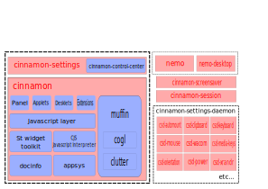

# Cinnamon

The Cinnamon desktop environment is a very large development project.

Between 2006 and 2010 the main desktop environment for Linux Mint was GNOME 2. It was very stable and very popular.

In 2011, Linux Mint 12 was unable to ship with GNOME 2. The upstream GNOME team had released a brand new desktop (GNOME 3 aka "Gnome Shell") which was using new technologies (Clutter, GTK3), which had a completely different design and implemented a radically different paradigm than its predecessor but which used the same namespaces and thus it couldn't be installed alongside GNOME 2. Following the decision from Debian to upgrade GNOME to version 3, GNOME 2 was no longer available in Linux Mint.

To tackle this issue two new projects were started:

- A project called **MATE** was started by a developer called Perberos. Its goal was to rename and repackage GNOME 2 so that it could be just as it was before.
- A project called **MGSE** was started by Linux Mint. Its goal was to develop extensions for GNOME 3 to give it back some of the functionality it had lost and which was available in GNOME 2 (a panel, a systray, an application menu, a window-centric alt-tab selector, a window-list..etc).

Linux Mint 12 shipped with both MATE and GNOME3+MGSE.

6 months later and after a huge amount of work, MATE was becoming stable, and from a set of extensions MGSE became a fork of GNOME 3 called Cinnamon.

Linux Mint 13 was the first Linux release to ship with the Cinnamon desktop. Since then Linux Mint has a MATE and a Cinnamon edition, both providing users with a conservative desktop paradigm, one forked from GNOME 2 and the other forked and derived from GNOME 3.

---

## Processes

The figure above shows the various processes at play within a Cinnamon session.

After you log in, the following processes are automatically started:

- `cinnamon-session` (the session manager which starts all the other processes)
- `cinnamon` (which is the visual part of the cinnamon desktop)
- `nemo-desktop` (which handles the desktop icons and desktop context menu)
- `cinnamon-screensaver` (the screensaver)
- various `csd-*` processes (which are settings daemon plugins and run in the background)

The `nemo` process starts when you browse files and directories. It remains open as long as at least one file manager window is open.

The `cinnamon-settings` process starts when you launch the `System Settings` and remains open as long as at least one configuration module is open.

---

## Libraries

### cinnamon-menus

The `cinnamon-menus` library provides utility functions to read and monitor the set of desktop applications installed on the computer. Thanks to `cinnamon-menus`, Cinnamon can quickly list installed applications within the application menu, fetch application icons for the menu, the alt-tab selector and the window-list and keep this data in sync whenever applications are installed or removed from the computer.

The `cinnamon-menus` library is developed in C and the source code is available on [GitHub](https://github.com/linuxmint/cinnamon-menus).

### cinnamon-desktop

`cinnamon-desktop` is a set of utility libraries and settings used by other Cinnamon components.

Whenever multiple desktop components need to access the same resource (whether this is a setting or a utility function), we place this resource in `cinnamon-desktop`.

Here’s an overview of some of the resources currently in `cinnamon-desktop`:

| Resource             | Description                                                                 |
|----------------------|-----------------------------------------------------------------------------|
| cinnamon.desktop     | dconf settings schemas used by several Cinnamon components                  |
| libcvc               | A PulseAudio utility library used to control sound volume and devices       |
| gnomerr              | An Xrandr utility library to detect, load and save monitor configurations   |
| gnome-xkb            | A keyboard layout utility library                                           |
| gnome-bg             | A wallpaper utility library                                                 |
| gnome-installer      | A cross-distribution library used to install software applications          |

The `cinnamon-desktop` library is developed in C and the source code is available on [GitHub](https://github.com/linuxmint/cinnamon-desktop).

### muffin

Muffin, or `libmuffin` to be more precise, is a window management library.

Within the Cinnamon desktop environment, the Window Manager isn't running in a separate process. The main `cinnamon` process implements the `libmuffin` library and therefore runs both the visible components (panel, applets, etc.) and the window manager.

> **Note:** The `muffin` package also provides a `muffin` binary. This binary is a small program which implements `libmuffin` and provides a minimal window manager, sometimes used by developers for troubleshooting. Whether or not `muffin` is installed by default in Linux Mint, it doesn’t run by default in a Cinnamon session. The `cinnamon` process, which also implements `libmuffin`, is the default window manager.

The clutter and cogl libraries are also part of the `muffin` package now.

Muffin is developed in C and the source code is available on [GitHub](https://github.com/linuxmint/muffin).

### cjs

CJS is Cinnamon’s JavaScript interpreter. It uses MozJS (Mozilla's [SpiderMonkey](https://spidermonkey.dev/)) and makes it possible to work with GObject and interact with GIR, GNOME, and Cinnamon libraries using that language.

CJS is run by and within the main `cinnamon` process and the parts of the desktop written in JavaScript are contained in the main Cinnamon component.

CJS is developed in C++ and JavaScript and the source code is available on [GitHub](https://github.com/linuxmint/cjs).

---

## Core Components

### cinnamon-session

The Cinnamon session manager is responsible for launching all the components needed by the session after you log in and closing the session properly when you log out.

It also provides a DBus interface for presence awareness and application clean-up.

### cinnamon-settings-daemon

`cinnamon-settings-daemon` is a collection of background processes during your Cinnamon session.

| Process                | Description                                                                 |
|------------------------|-----------------------------------------------------------------------------|
| csd-automount          | Automatically mounts hardware devices                                       |
| csd-clipboard          | Manages the copy-paste buffer                                               |
| csd-housekeeping       | Handles thumbnail cache and monitors disk space                             |
| csd-keyboard           | Handles keyboard layouts                                                     |
| csd-media-keys         | Handles media keys                                                          |
| csd-mouse              | Handles mice and touch devices                                              |
| csd-orientation        | Handles accelerometers and orientation                                      |
| csd-power              | Handles battery and power management                                        |
| csd-print-notifications| Handles printer notifications                                               |
| csd-wacom              | Handles Wacom devices                                                       |
| csd-xrandr             | Handles monitor configuration                                               |
| csd-xsettings          | Handles X11 and GTK settings                                                |

Cinnamon-settings-daemon is developed in C and is available on [GitHub](https://github.com/linuxmint/cinnamon-settings-daemon).

---

## Visible Desktop Layer

### cinnamon-screensaver

The Cinnamon screensaver locks the screen and manages some power functions.

Developed in Python, available on [GitHub](https://github.com/linuxmint/cinnamon-screensaver).

### cinnamon

The Cinnamon project includes:

**C components:**

| Component | Description                                               |
|-----------|-----------------------------------------------------------|
| St        | Widget toolkit                                            |
| Appsys    | Application metadata                                      |
| DocInfo   | Recently opened documents                                 |
| Tray      | Status icon management                                    |

**JavaScript components:**

| Component     | Description                                |
|---------------|--------------------------------------------|
| Cinnamon JS   | Panels, effects, HUD, etc.                 |
| Applets       | Panel applets                              |
| Desklets      | Desktop widgets                            |

**Python:**

- System Settings and configuration modules

Cinnamon is available on [GitHub](https://github.com/linuxmint/cinnamon).

### nemo

Nemo is the Cinnamon file manager.

- `nemo-desktop`: manages desktop icons and context menu

Nemo is developed in C and available on [GitHub](https://github.com/linuxmint/nemo).

### nemo-extensions

Nemo has extensions written in both C and Python.

Available on [GitHub](https://github.com/linuxmint/nemo-extensions).

### cinnamon-control-center

A few Cinnamon configuration modules are still written in C and reside in this component.

> **Note:** Originally all config modules came from GNOME's `gnome-control-center`. Most have since been rewritten in Python.

| Module         | Purpose                           |
|----------------|-----------------------------------|
| color          | Color profiles                    |
| datetime       | Date and Time                     |
| display        | Display configuration             |
| network        | Network configuration             |
| online-accounts| Online Accounts                   |
| wacom          | Wacom devices                     |

Available on [GitHub](https://github.com/linuxmint/cinnamon-control-center).
