# Mint tools

The first Mint tools were developed around 2006 when the Linux Mint project was born. Throughout the years, new tools were added to Linux Mint to implement functions that it was missing, or to make the user experience easier and more comfortable.

Some tools, which were very useful in the past, also disappeared when they were no longer needed. Here's a list of the currently active tools projects developed by Linux Mint.

---

## mint-common

Common utility functions and libraries used by the Mint tools are placed in the mint-common project.

This project is developed in Python and its source code is available on [GitHub](https://github.com/linuxmint/mint-common).

---

## mintbackup

The **Backup Tool**, mintbackup, makes it easy to save and restore backups of files within the home directory.

It also supports the ability to save the list of installed packages, so they can be reinstalled later.

This project is developed in Python and its source code is available on [GitHub](https://github.com/linuxmint/mintbackup).

---

## mintdesktop

This is a tool which provides some additional settings for the MATE desktop environment and the ability to switch window managers.

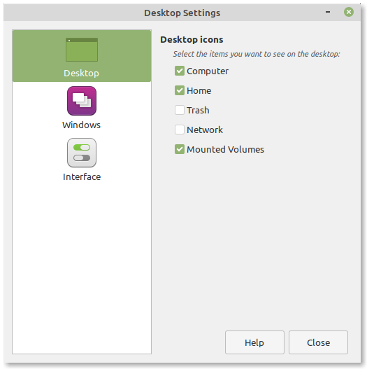

This project is developed in Python and its source code is available on [GitHub](https://github.com/linuxmint/mintdesktop).

---

## mintdrivers

The **Driver Manager**, mintdrivers, makes it easy to install proprietary drivers when applicable.

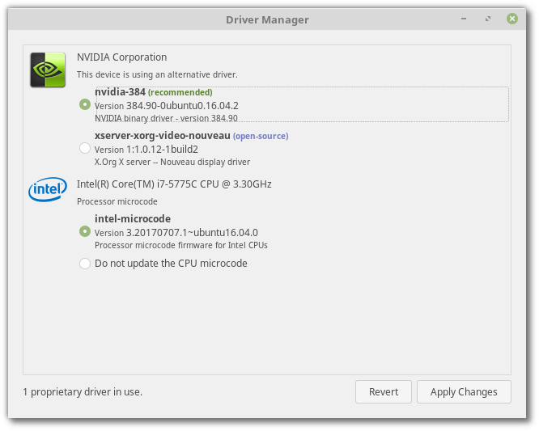

It relies on the `ubuntu-drivers` backend and isn't available in LMDE.

This project is developed in Python and its source code is available on [GitHub](https://github.com/linuxmint/mintdrivers).

---

## mintinstall

The **Software Manager**, mintinstall, is an App store for Free Software. It provides access to popular applications from within the repository.

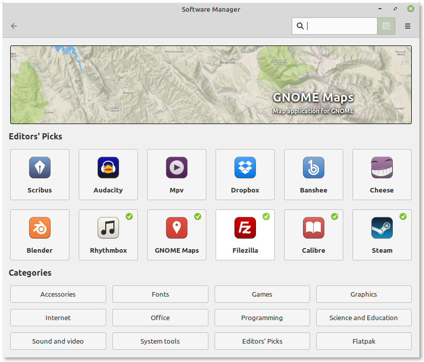

It's also compatible with Flatpak and able to list flatpaks from multiple flatpak repositories.

This project is developed in Python and its source code is available on [GitHub](https://github.com/linuxmint/mintinstall).

---

## mintlocale

The mintlocale project provides two configuration tools.

The first one is dedicated to locale selection and installation.

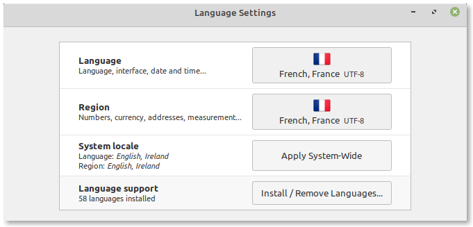

The second one is dedicated to input methods:

This project is developed in Python and its source code is available on [GitHub](https://github.com/linuxmint/mintlocale).

---

## mintmenu

This is the main application menu for the MATE edition of Linux Mint.

This project is developed in Python and its source code is available on [GitHub](https://github.com/linuxmint/mintmenu).

---

## mintnanny

The **Domain Blocker**, mintnanny, blocks outgoing traffic towards chosen domain names using /etc/hosts.

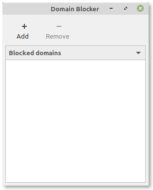

This project is developed in Python and its source code is available on [GitHub](https://github.com/linuxmint/mintnanny).

---

## mintreport

The **System Reports**, mintreport, provides system information and helps the user collect information about application crashes.

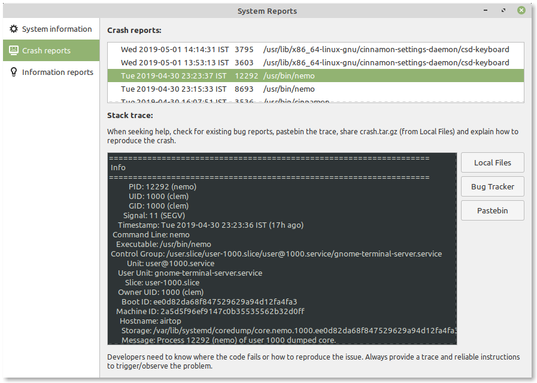

This project is developed in Python and its source code is available on [GitHub](https://github.com/linuxmint/mintreport).

---

## mintsources

The **Software Sources** configuration tool, mintsources, helps the user configure software repositories, choose a mirror, add PPAs and perform maintenance tasks related to package management.

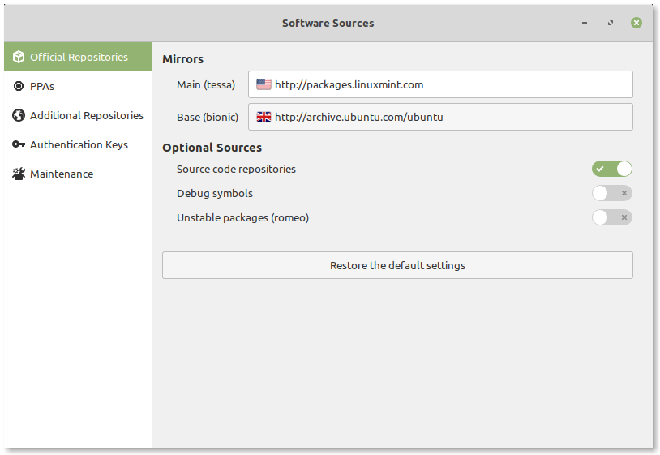

This project is developed in Python and its source code is available on [GitHub](https://github.com/linuxmint/mintsources).

---

## mintstick

The mintstick project provides two utilities.

The first one is dedicated to formatting USB sticks.

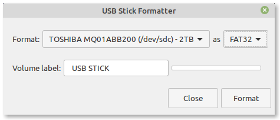

The second one is used to make live USB sticks from ISO images:

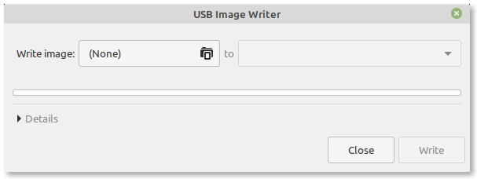

This project is developed in Python and its source code is available on [GitHub](https://github.com/linuxmint/mintstick).

---

## mintsystem

This project provides small utilities, as well as files, scripts and resources used by the OS.

---

## mintupdate

The **Update Manager**, mintupdate, provides users with software and security updates.

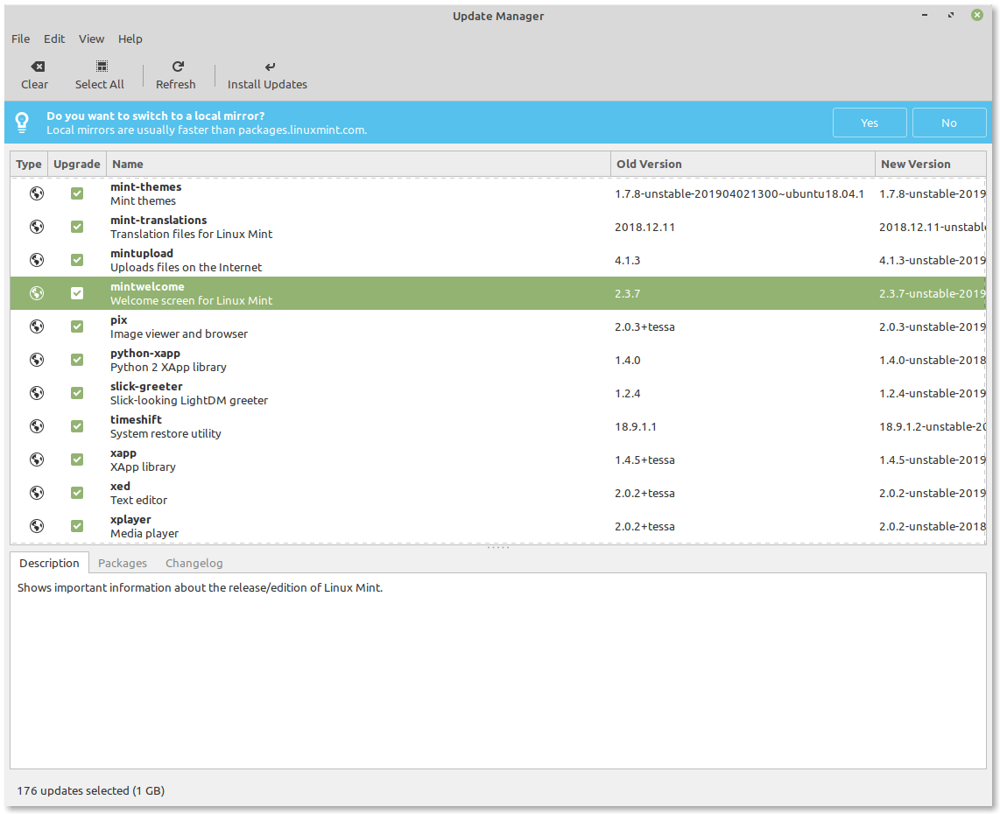

This project is developed in Python and its source code is available on [GitHub](https://github.com/linuxmint/mintupdate).

---

## mintupload

The **Upload Manager**, mintupload, allows the user to upload files to a particular location, without browsing it, just by dropping the files with the mouse.

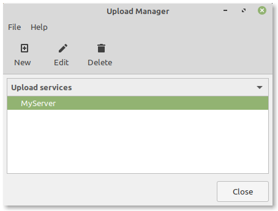

This project is developed in Python and its source code is available on [GitHub](https://github.com/linuxmint/mintupload).

---

## mintwelcome

The **Welcome Screen**, mintwelcome, welcomes new users into Linux Mint and guides them through their first steps.

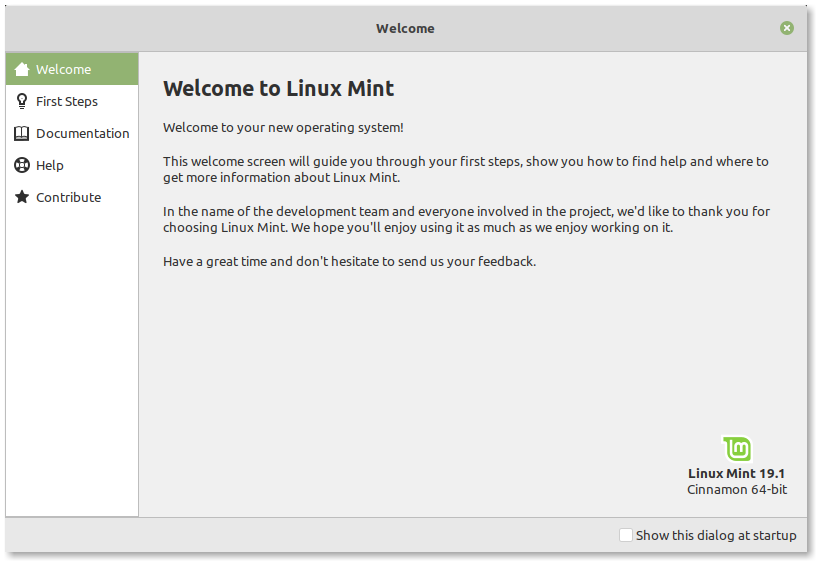

This project is developed in Python and its source code is available on [GitHub](https://github.com/linuxmint/mintwelcome).

