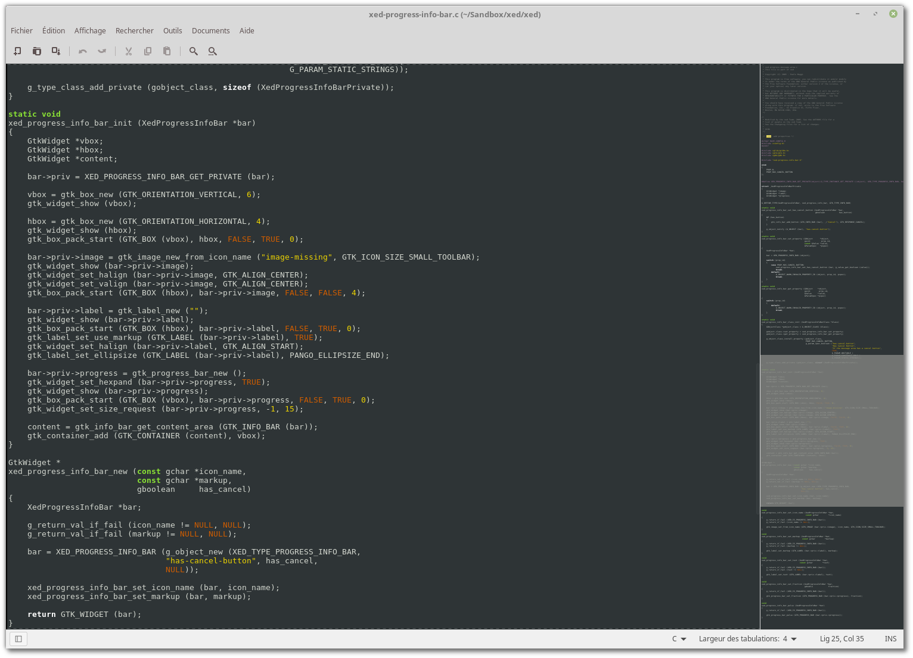
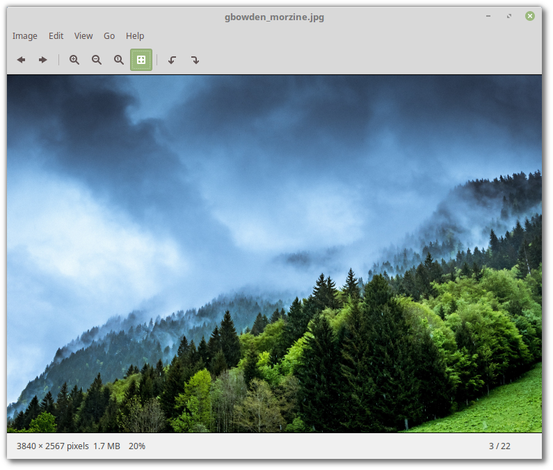
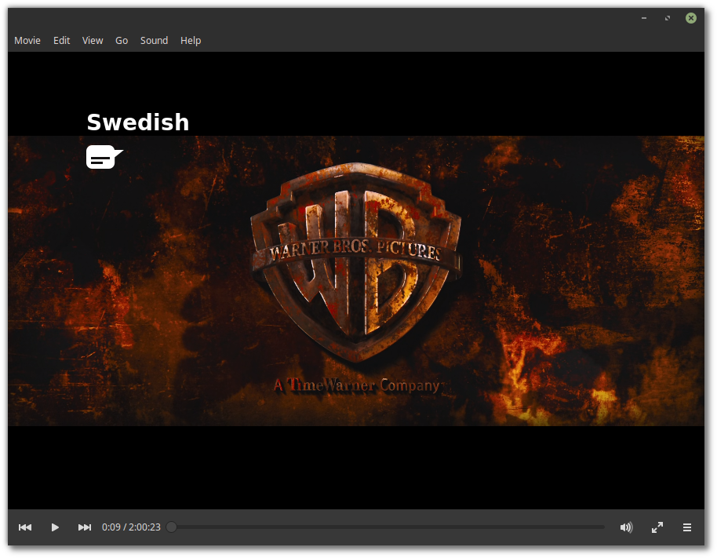
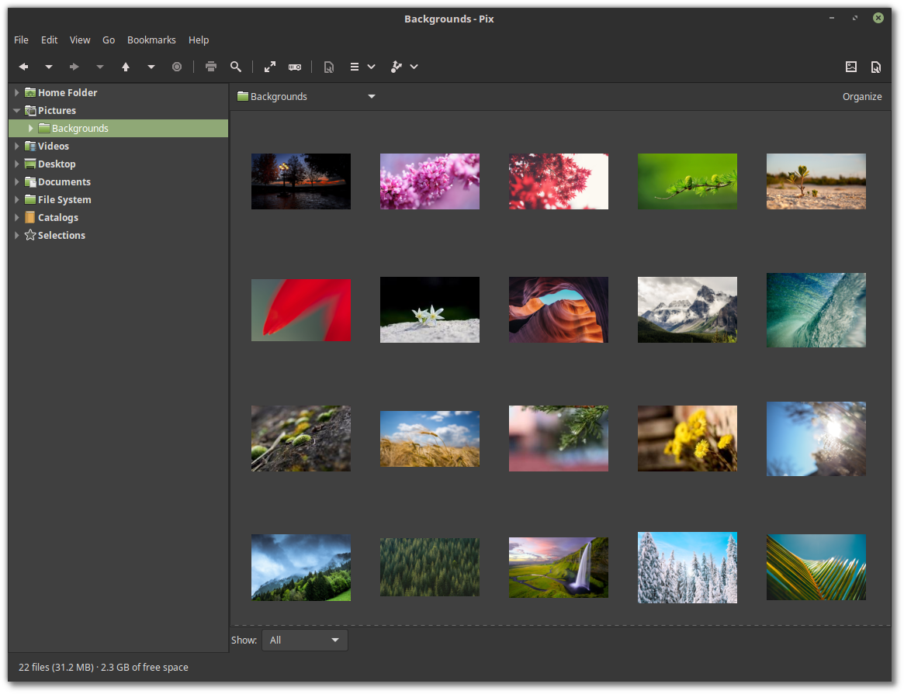
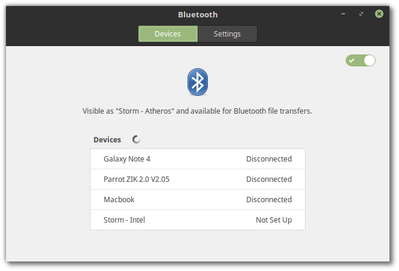
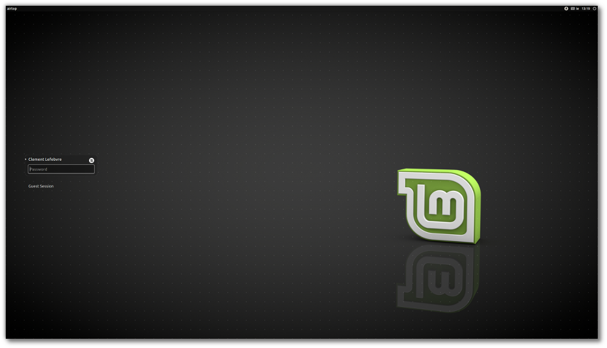
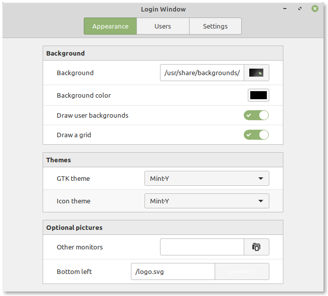

# XApps

A project called **X-Apps** was started in 2016 to produce generic applications for traditional GTK desktop environments.

The idea behind this project is to replace applications which no longer integrate properly outside of a particular environment (this is the case for a growing number of GNOME applications) and to give our desktop environments the same set of core applications, so that each change, each new feature being developed, each little improvement made in one of them will benefit not just one environment, but all of them.

## Core Ideas

- Use modern toolkits and technologies (GTK3 for HiDPI support, gsettings, etc.)
- Use traditional user interfaces (titlebars, menubars)
- Work everywhere (generic, desktop-agnostic and distro-agnostic)
- Provide functionality users already enjoy (or enjoyed in the past)
- Be backward-compatible (to work on as many distributions as possible)

Within Linux Mint, users didn't need to adapt to X-Apps, because in many cases, they were very similar or exactly the same as the applications people were already using. For instance, Totem 3.18 was radically different from Totem 3.10 (shipped with Linux Mint 17), but **Xplayer 1.0** (default media player in Linux Mint 18) was exactly the same.

> The goal of X-Apps is not to reinvent the wheel — quite the opposite: it's to ensure continued maintenance of the applications we already enjoyed, and to guide their development in a way that benefits multiple desktop environments.

It makes no sense to develop multiple versions of the same tool. When we work on projects like these, we want them to matter across all editions.

> All three editions of Linux Mint come with the same XApps libraries and applications.

---

## XApps Projects

### libxapp

The core XApps library. Anything that is cross-desktop goes here.  
Available in Python and JS via GObject Introspection.  
[GitHub – linuxmint/xapps](https://github.com/linuxmint/xapps)

---

### python-xapp

Small Python library providing extra functionality.  
[GitHub – linuxmint/python-xapp](https://github.com/linuxmint/python-xapp)

---

### xed

Default text editor based on **Pluma**.

[GitHub – linuxmint/xed](https://github.com/linuxmint/xed)

---

### xviewer

Default image viewer based on **Eye of GNOME**.

[GitHub – linuxmint/xviewer](https://github.com/linuxmint/xviewer)

---

### xplayer

Default media player for music and videos, based on **Totem**.

[GitHub – linuxmint/xplayer](https://github.com/linuxmint/xplayer)

---

### xreader

Default document and PDF viewer, based on **Atril**.

[GitHub – linuxmint/xreader](https://github.com/linuxmint/xreader)

---

### pix

Photo manager and organizer, based on **gThumb**.

[GitHub – linuxmint/pix](https://github.com/linuxmint/pix)

---

### blueberry

Frontend to `gnome-bluetooth` with systray support.

> GNOME Bluetooth’s frontend was removed and merged into GNOME Control Center, making it unusable outside GNOME. **Blueberry** provides this missing frontend for other GTK desktops.

[GitHub – linuxmint/blueberry](https://github.com/linuxmint/blueberry)

---

### slick-greeter

Default login screen (LightDM greeter), originally forked from `unity-greeter`.

> Modified to run independently of `gnome-settings-daemon`, GNOME, or Unity.

[GitHub – linuxmint/slick-greeter](https://github.com/linuxmint/slick-greeter)

---

### lightdm-settings

Configuration tool to set up **LightDM** and **slick-greeter**.

[GitHub – linuxmint/lightdm-settings](https://github.com/linuxmint/lightdm-settings)
